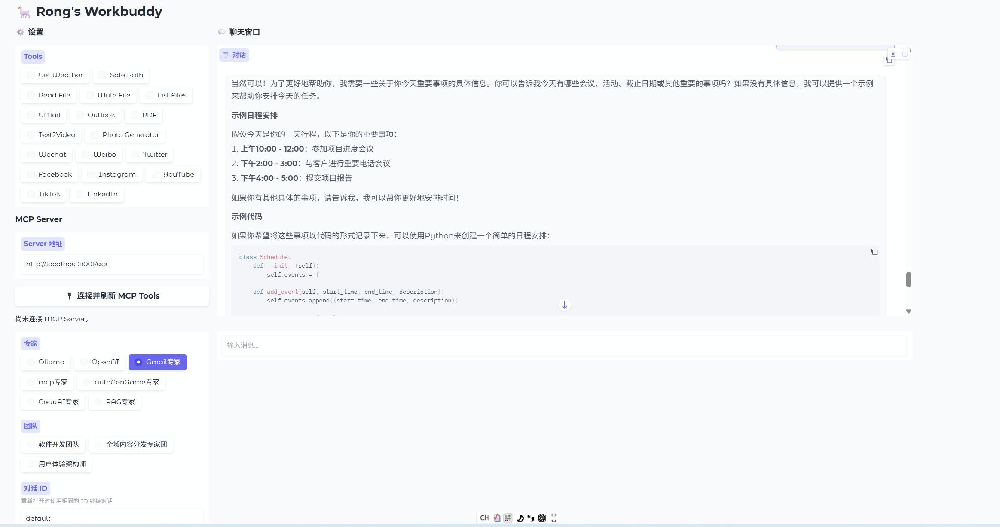
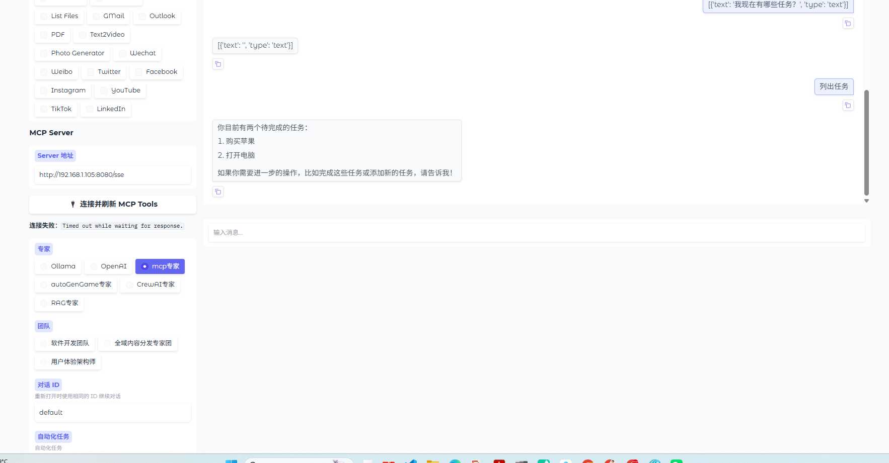
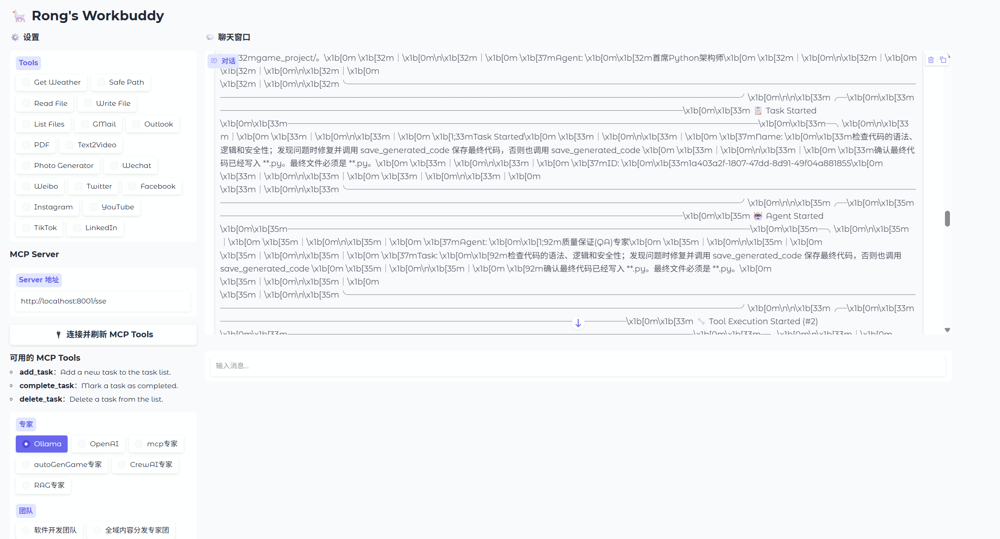
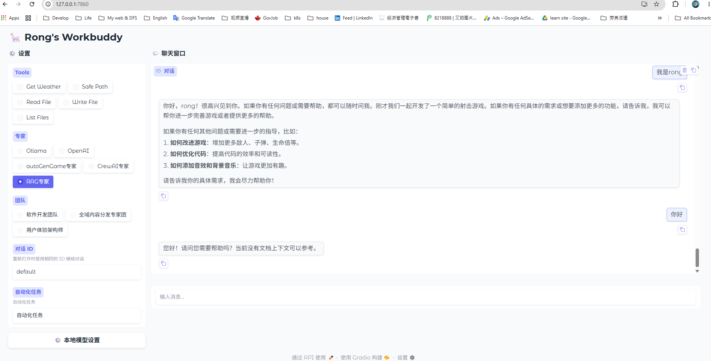

# Workbuddy

> A hands-on AI Agent learning lab — from zero-tool chatbots to multi-agent development teams, all running on local LLMs.

Workbuddy is the flagship demo of the [MyAIJourney](https://github.com/YourUser/MyAIJourney) repository. It is a single Gradio web app that unifies **seven different agent architectures** behind one chat interface, letting you switch between them in real time and observe how each paradigm approaches the same problem differently.

Every model runs locally through [Ollama](https://ollama.com) — no OpenAI API key required.

---

## Table of Contents

- [Why This Project Exists](#why-this-project-exists)
- [AI Agent Learning Roadmap](#ai-agent-learning-roadmap)
- [Architecture Overview](#architecture-overview)
- [Project Structure](#project-structure)
- [Prerequisites](#prerequisites)
- [Installation](#installation)
- [Usage](#usage)
- [Module Walkthrough](#module-walkthrough)
- [Tech Stack](#tech-stack)
- [Roadmap & Future Work](#roadmap--future-work)
- [License](#license)

---

## Why This Project Exists

Most AI agent tutorials stop at "here's how to call an LLM." They skip the hard parts: tool integration, memory management, multi-agent orchestration, and the messy engineering needed to make agents actually *do* things reliably.

Workbuddy bridges that gap. It is a deliberately progressive codebase where each module builds on the previous one, forming a complete learning path from raw API calls to autonomous development teams. The code is intentionally readable — not abstracted behind frameworks — so you can trace exactly what happens when an agent thinks, acts, and responds.

---

## AI Agent Learning Roadmap

The project is structured as a seven-stage learning journey. Each stage introduces a new concept and is implemented as a standalone module you can read end-to-end.

### Stage 1 — Raw LLM Chat

**File:** `url_client.py`

Start with the fundamentals: talk directly to Ollama's `/api/chat` endpoint using plain HTTP requests. No frameworks, no abstractions. You learn:

- How streaming token generation works at the protocol level
- How to construct the `messages` array (system / user / assistant roles)
- How to handle SSE-style newline-delimited JSON responses

This is the foundation everything else builds on.

### Stage 2 — ReAct Agent with Tools (LangChain)

**File:** `localChatOllama.py`

Give the model tools and let it reason about *when* and *how* to use them. Uses LangChain's `initialize_agent` with `ZERO_SHOT_REACT_DESCRIPTION` agent type. Tools include:

| Tool | What It Does |
|------|-------------|
| `ddgs_search` | Web search via DuckDuckGo |
| `browser_render` | Headless Chromium page rendering (Playwright) |
| `http_fetch` | Plain HTTP GET for APIs and endpoints |
| `download_pdf_text` | Download and extract text from PDF files |
| `get_weather` | Real-time weather via Open-Meteo (no API key needed) |

You learn the **Thought → Action → Observation** loop and why grounding matters (the system prompt explicitly tells the agent not to treat SERPs as evidence).

### Stage 3 — Native Function Calling (OpenAI-Compatible API)

**File:** `localOpenAI.py`

Instead of LangChain's ReAct wrapper, use the native tool-calling protocol that OpenAI-compatible APIs provide. The Ollama server (`/v1/chat/completions`) supports `tools` and `tool_calls` natively. This module:

- Converts LangChain `StructuredTool` objects into OpenAI function schemas
- Streams responses while accumulating tool-call deltas
- Executes tool calls and feeds results back into the conversation loop
- Persists conversation history to a JSON file keyed by `conversation_id`

You learn the difference between *prompt-based* agent reasoning (ReAct) and *protocol-based* function calling.

### Stage 4 — Retrieval-Augmented Generation (RAG)

**File:** `ragAgent.py`

Connect an agent to a knowledge base. Uses:

- `DirectoryLoader` to ingest `.txt` files from a `docs_to_load/` folder
- `OllamaEmbeddings` for local vectorization
- `FAISS` for similarity search
- LangChain's `create_agent` with retrieval + tool-calling

You learn how to combine retrieved context with live tool calls (Wikipedia search, date calculation) in a single agent.

### Stage 5 — Model Context Protocol (MCP)

**Directory:** `mcpServer/`

MCP is Anthropic's open standard for exposing tools, resources, and prompts to LLMs as a standardized service. This project includes **three independent MCP servers** and two client implementations:

| Server | Port | Tools Exposed |
|--------|------|---------------|
| `mcp_server.py` | 8080 | `add`, `greet`, `multiply`, `get_time` |
| `mcp_server2.py` | 8081 | `get_weather`, `save_note`, `list_notes`, `search_users` |
| `mcp_server3.py` | 8082 | `wikipedia` (live API search) |
| `app.py` | 8001 | Full task tracker: `add_task`, `complete_task`, `delete_task` + resources & prompts |

Clients:
- `client.py` — `MCPChatClient`: discovers tools from an MCP server, converts schemas to OpenAI function format, and lets the LLM call them autonomously.
- `client_ollama.py` — Connects to multiple MCP servers simultaneously and uses LangChain's `AgentExecutor` for orchestration.

You learn how to decouple *tool providers* from *tool consumers* — a pattern that matters when tools live in different processes, languages, or machines.

### Stage 6 — Multi-Agent Systems

Two frameworks, same goal: build a software development team where agents collaborate.

#### 6a — CrewAI (Sequential Pipeline)

**File:** `crewaiAgent.py`

A three-agent crew that runs in sequence:

```
Product Manager → Python Developer → QA Engineer
```

Each agent has a role, goal, backstory, and assigned tools. The `save_generated_code` tool ensures code is written to disk, not just printed. You learn role-based agent design and sequential task handoff.

#### 6b — AutoGen (Round-Robin Team Chat)

**File:** `autogenGame.py`

A five-agent team that develops browser games via `RoundRobinGroupChat`:

```
Market Researcher → Architect → Game Designer → Programmer → QA
```

The Programmer agent has file tools (`read_file`, `write_file`, `append_file`, `list_files`, `validate_project`) and writes real HTML/JS/CSS to `game_project/`. The team iterates until QA passes or `TERMINATE` is reached.

You learn multi-agent conversation patterns, termination conditions, and how to give agents real-world tools with safety constraints (path sandboxing to `game_project/`).

### Stage 7 — Graph-Based Agent Orchestration (LangGraph)

**File:** `developer.py`

The most advanced module. A `StateGraph` that implements a full product development pipeline with retry loops:

```
START → Design → Coding → Coding Tools → QA → QA Tools → QA Decision
                                    ↑                          |
                                    └──── FAIL (retry) ───────┘
                                    └──── PASS → END ─────────┘
```

Key engineering details:
- **State management**: `DeveloperState` tracks messages and iteration count
- **Conditional routing**: QA's output (`QA_STATUS: PASS` / `QA_STATUS: FAIL`) determines the next node
- **Tool enforcement**: Coding node uses `tool_choice="required"` to force `write_file` calls
- **Fallback code**: If the LLM produces invalid output, pre-built app templates are injected
- **Validation gates**: `route_after_qa` checks syntax, requirements match, and iteration limits before allowing termination
- **Progress reporting**: Real-time human-readable progress messages for each node

You learn how to build deterministic workflows around non-deterministic LLMs — the core challenge of production agent systems.

### Bonus — Real-World Tool Integrations

**Directory:** `mytool/`

| Module | Capability |
|--------|-----------|
| `gmail_listener.py` | IMAP polling + AI-generated email replies via Ollama |
| `text2voice/generate.py` | Text-to-speech using VoxCPM2 with reference audio |
| `youtube/upload.py` | YouTube Data API v3 video upload with thumbnail |

These demonstrate connecting agents to external services that require authentication, rate limits, and real-world error handling.

---

## Architecture Overview

```
┌─────────────────────────────────────────────────────┐
│                   Gradio Web UI                     │
│                  (app.py — main entry)              │
│                                                     │
│  ┌─────────────┐  ┌──────────────┐  ┌────────────┐ │
│  │  Settings    │  │  Chat Window │  │  Tools     │ │
│  │  Panel       │  │  (streaming) │  │  Selector  │ │
│  └──────┬───────┘  └──────┬───────┘  └─────┬──────┘ │
└─────────┼─────────────────┼────────────────┼────────┘
          │                 │                │
          ▼                 ▼                ▼
┌─────────────────────────────────────────────────────┐
│              Client Factory (myclient.py)            │
│                                                     │
│  getClient(special, model, temp, memory, tools)      │
└──────────────────────┬──────────────────────────────┘
                       │
        ┌──────────────┼──────────────┐
        ▼              ▼              ▼
┌──────────────┐ ┌────────────┐ ┌────────────┐
│ Ollama Client│ │ OpenAI     │ │ Game Expert │
│ (LangChain   │ │ Compatible │ │ (AutoGen)   │
│  ReAct)      │ │ (Tool Call)│ │             │
└──────┬───────┘ └─────┬──────┘ └──────┬──────┘
       │               │               │
       ▼               ▼               ▼
┌─────────────────────────────────────────┐
│          Ollama (localhost:11434)        │
│    qwen2.5:7b / llama3.2:3b / ...       │
└─────────────────────────────────────────┘
```

### Design Principles

1. **Unified interface** — Every agent backend implements `streamChat(user_input, history, model, temperature, top_p, conversation_id)` as a generator, so the UI doesn't care which engine is running.
2. **Local-first** — All inference goes through Ollama. No external API keys for the core functionality.
3. **Progressive complexity** — Each module can be read and understood independently, but they build on shared concepts.
4. **Real tools, not mocks** — File I/O, web search, and code execution are real. Sandboxing (`safe_path`) prevents path traversal.

---

## Project Structure

```
Workbuddy/
├── app.py                    # Gradio web UI — main entry point
├── myclient.py               # Client factory — routes to the right agent backend
├── url_client.py             # Stage 1: Raw Ollama HTTP API client
├── localChatOllama.py        # Stage 2: LangChain ReAct agent with tools
├── localOpenAI.py             # Stage 3: Native OpenAI function calling
├── ragAgent.py               # Stage 4: RAG with FAISS + document retrieval
├── mcpServer/                # Stage 5: MCP servers & clients
│   ├── app.py                #   Task tracker server (tools + resources + prompts)
│   ├── mcp_server.py         #   Calculator server
│   ├── mcp_server2.py        #   Weather + notes server
│   ├── mcp_server3.py        #   Wikipedia search server
│   ├── client.py             #   MCP chat client (OpenAI-compatible)
│   └── client_ollama.py      #   MCP client with LangChain AgentExecutor
├── crewaiAgent.py            # Stage 6a: CrewAI sequential dev team
├── autogenGame.py            # Stage 6b: AutoGen round-robin game dev team
├── developer.py              # Stage 7: LangGraph development pipeline
├── prompt_custom.py          # System prompts for PM, Architect, Developer, QA roles
├── rongtools.py              # Core tools: weather, file I/O, Python execution
├── rongfunctions.py          # Utility helpers (history serialization, etc.)
├── ronglog.py                # Logging configuration
├── mytool/                   # Bonus: real-world integrations
│   ├── gmail_listener.py     #   Gmail IMAP polling + AI auto-reply
│   ├── text2voice/           #   VoxCPM2 text-to-speech
│   └── youtube/              #   YouTube Data API v3 upload
├── game_project/             # Output directory for generated code
│   └── shooting_game.py      #   Sample game generated by AutoGen team
├── Default_memory.json       # Persisted conversation history
└── README.md                 # You are here
```

---

## Prerequisites

- **Python 3.10+**
- [Ollama](https://ollama.com) installed and running locally
- At least one model pulled:
  ```bash
  ollama pull qwen2.5:7b
  # Optional additional models:
  ollama pull llama3.2:3b-instruct-fp16
  ```

---

## Installation

```bash
# Clone the repository
git clone https://github.com/YourUser/MyAIJourney.git
cd MyAIJourney/Workbuddy

# Create and activate a virtual environment
python -m venv .venv
source .venv/bin/activate        # macOS/Linux
# .venv\Scripts\activate         # Windows

# Install dependencies
pip install gradio langchain langchain-ollama langgraph
pip install openai crewai autogen-agentchat
pip install fastmcp playwright ddgs requests httpx
pip install faiss-cpu pydantic pymsgbox

# Install Playwright browsers (for the browser_render tool)
playwright install chromium

# Verify Ollama is running
curl http://localhost:11434/api/tags
```

### Environment Variables

For the bonus integrations (Gmail, YouTube), create a `.env` file in the project root:

```env
# Gmail listener
GMAIL_EMAIL=your_email@gmail.com
GMAIL_APP_PASSWORD=your_app_password
GMAIL_CHECK_INTERVAL=30
GMAIL_SEND_REPLIES=false

# YouTube upload
# Requires client_secrets.json from Google Cloud Console
```

The core Workbuddy app does **not** require any environment variables.

---

## Usage

### Launch the Web App

```bash
python app.py
```

The app opens at `http://127.0.0.1:7860`.

### Using the Interface

1. **Select an expert** in the sidebar:
   - **Ollama** — LangChain ReAct agent with tools (Stage 2)
   - **OpenAI** — Native function calling agent (Stage 3)
   - **Game Expert** — AutoGen multi-agent game development team (Stage 6b)
   - **CrewAI Expert** — CrewAI software development crew (Stage 6a)

2. **Configure the model** (optional):
   - Click the gear button to open the settings panel
   - Select a model from the dropdown (auto-populated from Ollama)
   - Adjust temperature and top-p sliders
   - Click "Save and Close"

3. **Set a conversation ID**:
   - Use the same ID across sessions to continue a conversation
   - Conversation history is persisted to JSON files

4. **Select tools** (for Ollama/OpenAI modes):
   - Check the tools you want the agent to have access to

5. **Chat**:
   - Type your message and press Enter
   - Responses stream in real time

### Running Modules Standalone

Each module is independently runnable for learning purposes:

```bash
# Stage 1: Raw chat
python url_client.py

# Stage 2: ReAct agent (interactive REPL)
python localChatOllama.py

# Stage 4: RAG agent (interactive)
python ragAgent.py

# Stage 6a: CrewAI dev team
python crewaiAgent.py

# Stage 6b: AutoGen game team
python autogenGame.py

# Stage 7: LangGraph development pipeline
python developer.py

# MCP servers (run each in a separate terminal)
python mcpServer/mcp_server.py     # port 8080
python mcpServer/mcp_server2.py    # port 8081
python mcpServer/mcp_server3.py    # port 8082
python mcpServer/app.py            # port 8001

# MCP client smoke test
python mcpServer/client.py --server-url http://localhost:8001/sse
```

---

## Module Walkthrough

### The Client Factory (`myclient.py`)

All agent backends are unified through a factory pattern. The UI calls `getClient()` with a backend name, and the factory returns an object with a `streamChat()` generator method:

```python
def getClient(special, modelName, temperature, memory_file, custom_tools):
    if special == "OpenAI":
        return getLocalOpenAIClient(modelName, temperature, memory_file, custom_tools)
    return getLocalOllamaClient(modelName, temperature, memory_file, custom_tools)
```

This means switching between a ReAct agent, a function-calling agent, or a multi-agent team requires **zero UI changes** — just a different factory call.

### The ReAct Agent (`localChatOllama.py`)

The agent uses LangChain's `initialize_agent` with `AgentType.ZERO_SHOT_REACT_DESCRIPTION`. The system prompt enforces grounding:

> *"Do not treat search engine result pages (SERPs) as evidence. Always open and summarize at least one content page, PDF, or API response before concluding."*

Streaming is handled by wrapping `agent.stream()` and yielding incremental output to the Gradio chatbot.

### The Tool Sandbox (`rongtools.py`)

File operations are sandboxed to the `game_project/` directory:

```python
def safe_path(filepath: str) -> Path:
    full_path = (PROJECT_ROOT / filepath).resolve()
    if not str(full_path).startswith(str(PROJECT_ROOT)):
        raise ValueError("Access denied: path outside project root")
    return full_path
```

The `run_python` tool executes code in a subprocess with a 30-second timeout and captures both stdout and stderr.

### The LangGraph Pipeline (`developer.py`)

This is the most complex module. The graph has six nodes:

| Node | Role | LLM Config |
|------|------|------------|
| `design` | Product design + architecture | Low `num_predict=256`, no tools |
| `coding` | Write code to `app.py` | `tool_choice="required"` on `write_file` |
| `coding_tools` | Execute write_file calls | `ToolNode` (no LLM) |
| `qa` | Review and test code | Bound to `list_files`, `read_file`, `run_python` |
| `qa_tools` | Execute QA tool calls | `ToolNode` (no LLM) |
| `qa_decision` | Route based on QA result | Pure Python routing logic |

The retry loop is capped at `MAX_ITERATIONS = 10` to prevent infinite cycles. If the LLM produces non-Python output, fallback app templates (basic or SQLite-based) are injected.

---

## Tech Stack

| Layer | Technology |
|-------|-----------|
| **Web UI** | Gradio 6.x |
| **Local LLM Runtime** | Ollama (qwen2.5:7b, llama3.2:3b) |
| **Agent Framework — ReAct** | LangChain (`initialize_agent`, `StructuredTool`) |
| **Agent Framework — Graph** | LangGraph (`StateGraph`, `ToolNode`, `MessagesState`) |
| **Agent Framework — Sequential** | CrewAI (`Agent`, `Task`, `Crew`, `Process.sequential`) |
| **Agent Framework — Team Chat** | AutoGen (`RoundRobinGroupChat`, `AssistantAgent`) |
| **RAG** | LangChain + FAISS + OllamaEmbeddings |
| **MCP** | FastMCP (servers) + `fastmcp.Client` (clients) |
| **Web Automation** | Playwright (headless Chromium) |
| **Web Search** | DuckDuckGo (`ddgs`) |
| **Vector Store** | FAISS |
| **TTS** | VoxCPM2 |
| **Email** | imaplib / smtplib (Gmail) |
| **Video** | YouTube Data API v3 |

---

## Roadmap & Future Work

- [ ] Add LangGraph + MCP integration (use MCP tools inside graph nodes)
- [ ] Add a "Team" selector to switch between different multi-agent configurations in the UI
- [ ] Add conversation memory for AutoGen and CrewAI backends (currently stateless across sessions)
- [ ] Add a "compare mode" that runs the same prompt through multiple backends side by side
- [ ] Add evaluation metrics (tool call accuracy, task completion rate, latency)
- [ ] Replace JSON file memory with a proper database (SQLite)

---






## License

This project is part of the MyAIJourney repository. See the [LICENSE](../LICENSE) file in the repository root for details.

---

> Built as a learning project. Every line of code is meant to be read, understood, and modified. If you're learning AI agents, fork it, break it, and make it better.
