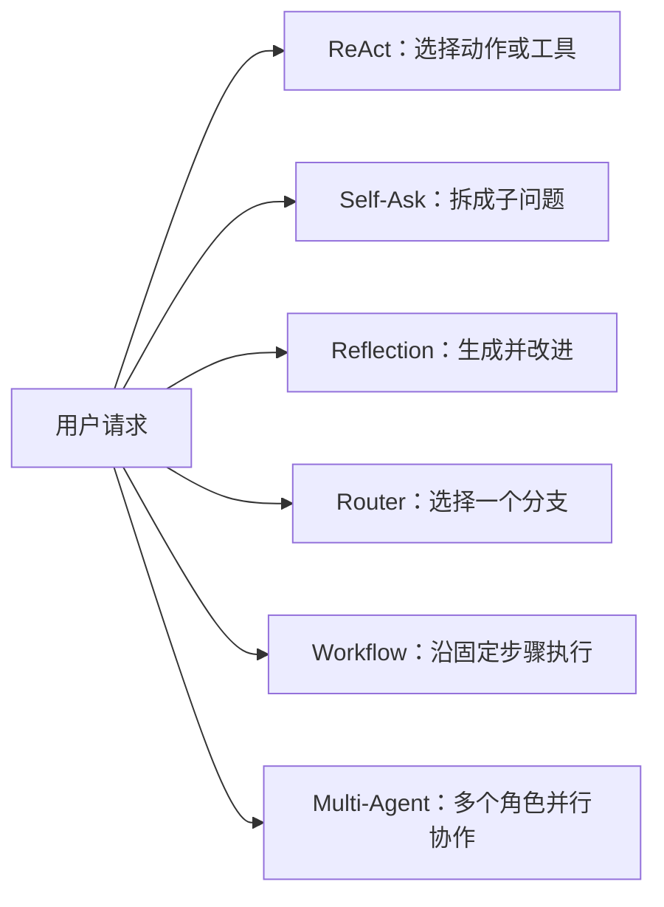

# Day 9：Agent 常见编排模式

本目录用 LangGraph 和 Ollama 演示了六种常见的 Agent 编排模式：ReAct、Self-Ask、Reflection、Router、Workflow 和 Multi-Agent。它们的核心区别在于：**系统如何决定下一步做什么，以及任务由谁、按什么顺序完成。**

## 目录中的示例

| 模式 | 示例文件 | 核心流程 | 下一步由谁决定 |
|---|---|---|---|
| ReAct | [`react.py`](react.py) | 思考是否需要工具 → 调用工具 → 根据结果继续或回答 | 模型根据当前结果选择动作 |
| Self-Ask | [`Self-Ask.py`](Self-Ask.py) | 拆分子问题 → 逐个回答 → 综合答案 | 模型负责拆题，程序按序处理 |
| Reflection | [`Reflection.py`](Reflection.py) | 生成初稿 → 审查 → 必要时修订并复查 | 程序根据审查结果决定是否继续 |
| Router | [`Router.py`](Router.py) | 分类请求 → 进入一个专家分支 → 回答 | 分类器选择处理路径 |
| Workflow | [`Workflow.py`](Workflow.py) | 分析 → 提纲 → 初稿 → 审查 → 定稿 | 预先定义的固定流程 |
| Multi-Agent | [`Multi-Agent.PY`](Multi-Agent.PY) | 多个角色并行分析 → 编辑整合 | 预先定义角色与汇总方式 |
| 项目交付 Agent | [`project_agent.py`](project_agent.py) | 需求分析 → 系统设计 → 代码生成 → QA → 失败修复迭代 | 固定阶段由 LangGraph 控制，QA 结果控制是否修复 |

> `react.py` 的注释也提到了 Plan-and-Execute，但本目录目前没有对应的实现脚本。该模式会在后文简要说明。

## 先用一张图建立直觉



这几种模式可以组合使用，不是互斥的框架。例如 Router 可以把问题交给某个 ReAct Agent；Workflow 的某一步也可以由多个 Agent 并行完成。

## 六种模式详解

### 1. ReAct：边推理边采取行动

ReAct 是 Reasoning + Acting 的缩写。模型观察用户问题和当前结果，决定是否调用工具；工具返回结果后，模型再决定下一步动作或给出最终答复。

本目录的 [`react.py`](react.py) 提供 `get_today` 和 `add_numbers` 两个工具。面对“今天几号，并计算 12.5 加 7.5”这类请求，模型可以按需调用日期和计算工具，再基于实际工具输出回答。如果问题不需要工具，也可以直接回答。

**适合场景**

- 查询数据库、搜索资料、调用 API 或执行计算。
- 需要根据工具返回结果决定是否继续查询或采取另一项动作。
- 请求多变，无法预先写死每个步骤。

**优势**

- 灵活，模型可以依据中间结果调整后续动作。
- 工具把精确计算、数据查询等工作交给确定性程序处理。

**代价与风险**

- 工具调用次数和总耗时不容易完全预测。
- 模型可能选择错误工具，或生成无效参数。
- 工具必须由程序做好权限、参数校验、超时和异常处理，不能只靠提示词保证安全。

### 2. Self-Ask：把复杂问题拆成可回答的子问题

Self-Ask 先让模型识别回答主问题所需的子问题，逐项回答，再综合各项结果。本目录的 [`Self-Ask.py`](Self-Ask.py) 最多保留 4 个子问题，并按顺序回答；后续回答会看到先前的回答，因此它不是并行搜索。

例如“团队为什么应该使用 Git？”可以拆为：Git 解决了什么问题、核心工作方式是什么、适合哪些场景，最后再将这些答案组织起来。

**适合场景**

- 问题包含多个相互关联的方面。
- 最终结论依赖几项前置解释或事实。
- 希望显式覆盖问题的组成部分，降低遗漏重点的概率。

**优势**

- 将复杂任务变得容易检查和逐步处理。
- 子问题和对应答案可以作为中间产物展示或记录。

**代价与风险**

- 拆解质量决定覆盖范围；漏掉关键子问题会导致最终答案片面。
- 顺序回答会增加延迟和模型调用成本。
- 当前示例依赖解析编号列表；若模型没有遵循格式，会退回到只回答原问题。

### 3. Reflection：先生成，再审查和修订

Reflection 建立一个质量反馈循环：先产出草稿，再审查事实性、完整性、可执行性和表达；如果仍有问题就修订并再次审查。本目录的 [`Reflection.py`](Reflection.py) 最多修订 2 次。

它的重点是**改进已有产物**，而不是只让模型把同一个答案重写一遍。审查者仍可能与作者共享模型盲点，所以 Reflection 不能替代可靠来源核查或人工审核。

**适合场景**

- 报告、方案、说明文档等对完成度要求较高的内容生成任务。
- 初稿容易遗漏要求，需要按清单检查。
- 可以接受额外调用，以换取一次或多次质量改进机会。

**优势**

- 让“生成”和“检查”成为显式步骤，便于审计和调试。
- 可以设置修订上限，避免无限循环。

**代价与风险**

- 审查与修订会增加延迟和成本。
- 审查意见可能错误或含糊，修订也可能引入新问题。
- 当前示例用固定短语“没有需要修改的问题”作为完成信号，比较脆弱；生产实现宜使用结构化审查结果和清晰的通过条件。
- 当前最终答案实际保存在 `draft` 字段中，`answer` 字段没有参与流程，可作为后续完善点。

### 4. Router：先分类，再走一条处理路径

Router 将请求分类后交给某个专门分支。本目录的 [`Router.py`](Router.py) 将问题分为 `coding`、`learning` 和 `general`，再由对应专家回答。

Router 解决的是“**这个请求交给谁处理**”；它本身不负责像 ReAct 那样持续观察工具结果并决定下一步动作。

**适合场景**

- 请求类别有限、边界相对清楚的客服、内部助手或任务入口。
- 不同类别需要不同提示词、工具、权限或模型。
- 各个处理分支需要单独开发、测试和维护。

**优势**

- 请求分类与具体处理逻辑分离。
- 可以按分支配置不同模型、工具和安全策略。

**代价与风险**

- 分类错误会把请求送到不合适的分支。
- 当前三个专家使用同一个 Ollama 模型，只是提示词不同，是路由结构示例，不等于真正独立的专业系统。
- 当前分类结果是普通文本，解析失败会回退到 `general`；生产系统可以用结构化输出、置信度阈值或澄清问题提升可靠性。

### 5. Workflow：按预定义步骤执行

Workflow 是开发者事先设计好步骤、输入和输出，再由图或程序依序执行。本目录的 [`Workflow.py`](Workflow.py) 把内容生成安排为：任务分析 → 提纲 → 初稿 → 质量检查 → 最终稿。

与 Self-Ask 不同，Workflow 的步骤由开发者根据业务流程预先确定，并非每次都让模型自行拆解任务。

**适合场景**

- 输入、步骤和产物比较稳定的流程，例如文档处理、审批准备和标准化报告生成。
- 强调可预测、可测试、可追踪，且每一步都有明确输入输出。
- 某些步骤必须按顺序完成，不能省略。

**优势**

- 控制力强，容易记录每一步的结果和失败位置。
- 测试时可以逐节点验证，也容易替换某一步的实现。

**代价与风险**

- 灵活性较低，遇到流程外情况时不会自动改计划。
- 每个模型节点都会带来调用成本。
- 当前示例的审查节点之后总是进入定稿节点，没有“审查不通过就返工”的条件分支，因此它是固定流水线，不是完整的质量门禁循环。

### 6. Multi-Agent：不同角色协作完成任务

Multi-Agent 将任务交给多个有不同职责的 Agent，再将结果汇总。本目录的 [`Multi-Agent.PY`](Multi-Agent.PY) 让分析员、风险审查员和执行顾问从不同角度处理同一问题，最后由编辑整合。三个角色并行运行，汇总节点等待三者都完成。

与 Workflow 相比，Workflow 强调**步骤之间的先后关系**；Multi-Agent 强调**角色之间的分工**。

**适合场景**

- 同一方案需要同时分析收益、风险和执行策略。
- 子任务相对独立，可以并行处理。
- 需要在最终结论中综合多个视角，而不是沿单一处理链加工。

**优势**

- 并行分工可缩短多个独立子任务的总等待时间。
- 角色提示词可以让输出聚焦于不同目标。

**代价与风险**

- 多角色会增加模型调用总量和成本，并要求模型服务支持足够并发。
- 结果可能重复、矛盾或各自有偏差，汇总者必须能比较和处理冲突。
- 当前示例的所有角色使用同一个模型、不同提示词；它演示的是角色分工和并行汇总，不代表拥有不同模型、独立记忆或不同工具权限的完整多智能体系统。

## 容易混淆的模式

### Router 与 ReAct

- **Router**：判断请求应该交给哪个处理器或专家。
- **ReAct**：判断当前要不要调用工具、调用什么工具，以及收到结果后怎么继续。
- **组合方式**：先由 Router 分到技术支持，再由该分支中的 ReAct Agent 搜索文档或查询系统。

### Workflow 与 Self-Ask

- **Workflow**：开发者预先定义步骤，追求流程可靠和可控。
- **Self-Ask**：模型根据当前问题生成子问题，追求问题拆解的适应性。
- **简单判断**：步骤基本固定用 Workflow；子问题随输入变化明显用 Self-Ask。

### Reflection 与 Multi-Agent

- **Reflection**：围绕一份产物形成“生成—审查—修订”的循环。
- **Multi-Agent**：多个角色分别产出不同视角，再由汇总者整合。
- **组合方式**：可以先让多个角色并行评审，再让作者依据评审结果修订。

### Workflow 与 Multi-Agent

二者描述不同维度，并不冲突。Workflow 描述任务步骤；Multi-Agent 描述角色分工。可以由 Workflow 管理整体流程，并在某个节点安排多个 Agent 并行完成子任务。

## 模式选择指南

| 需求 | 优先考虑 | 判断依据 |
|---|---|---|
| 需要模型选择 API、搜索、计算或其他工具 | ReAct | 下一步动作取决于运行时结果 |
| 问题要拆成多个相关部分再综合 | Self-Ask | 子问题随用户输入变化 |
| 初稿还需要检查和改进 | Reflection | 需要反馈循环和质量门槛 |
| 不同请求类型要交给不同处理逻辑 | Router | 先分类，再选择单一路径 |
| 业务步骤稳定且必须按序执行 | Workflow | 流程在运行前就能定义清楚 |
| 同一任务需要多个独立视角 | Multi-Agent | 角色可以分工，结果需要汇总 |

**一句话记忆：**ReAct 选动作，Self-Ask 拆问题，Reflection 改质量，Router 选分支，Workflow 定步骤，Multi-Agent 分角色。

## 补充：Plan-and-Execute

Plan-and-Execute 通常先生成整体计划，再逐步执行计划中的任务，并根据执行结果选择是否调整计划。它与 Self-Ask 的区别在于：Self-Ask 主要把问题拆成可回答的子问题；Plan-and-Execute 更强调形成可执行步骤、落实步骤以及必要时重新规划。

本目录目前只有 `react.py` 注释提到 Plan-and-Execute，没有对应的实现脚本，因此这里仅作概念说明。

## 当前示例的共同实现方式

- 模型通过 `ChatOllama` 创建，默认模型为 `gpt-oss:latest`。
- 可以通过 `OLLAMA_MODEL` 和 `OLLAMA_BASE_URL` 环境变量更换模型或服务地址。
- 除 ReAct 示例使用预建 Agent 接口外，其余图式流程使用 LangGraph 的 `StateGraph`。
- 示例重点是展示编排结构。实际部署还需要补充输入验证、错误与重试策略、日志、超时、权限控制、结构化输出，以及对模型输出的质量评估。

## 项目交付 Agent

[`project_agent.py`](project_agent.py) 将前面的模式组合成一个项目构建闭环：Workflow 固定阶段，需求分析和系统设计负责规划，代码生成与 Reflection 式 QA 修复负责迭代，最终以自动测试是否通过作为成功标准。

```powershell
python day9/project_agent.py "做一个命令行记账工具，支持收入支出、分类统计和 CSV 导出"
```

默认生成到当前目录下的 `generated_projects/`，每次在其中创建一个新的、带时间戳的项目目录。可通过 `--output-root` 指定父目录，通过 `--max-iterations` 设置 QA 轮数（1 到 8，默认 3）。模型仍使用 `OLLAMA_MODEL` 和 `OLLAMA_BASE_URL` 环境变量。

首版支持 Python 3（标准库 + `unittest`）和原生 Node.js JavaScript（内置模块 + `node:test`）；Node.js 项目需要本机已安装 `node`。TypeScript、JSX、第三方依赖安装和其他语言暂不支持。Agent 使用固定测试命令，不执行模型提供的 shell 命令，并将测试超时限制为 60 秒。

**安全边界：**输出项目目录是新建目录，不是操作系统沙箱。自动测试会以当前用户权限执行生成的测试代码；不要对不可信模型或不可信需求开启无人值守运行。若需在共享或生产环境使用，应在容器/虚拟机中运行 QA，并设置网络、文件系统、CPU、内存和进程权限限制。

QA 未通过会将测试日志交给修复阶段，并只接受新增/更新的相对路径文件。若模型输出格式无法解析，Agent 会额外尝试一次格式转换，并在失败报告中保留回复片段。路径穿越会被拒绝；如果检测到用户在运行期间改动了 Agent 管理的文件，会停止覆盖。达到轮数上限后会保留项目目录和失败报告，供人工检查。

工具本身的离线测试：

```powershell
python -m unittest tests.test_project_agent -v
```
